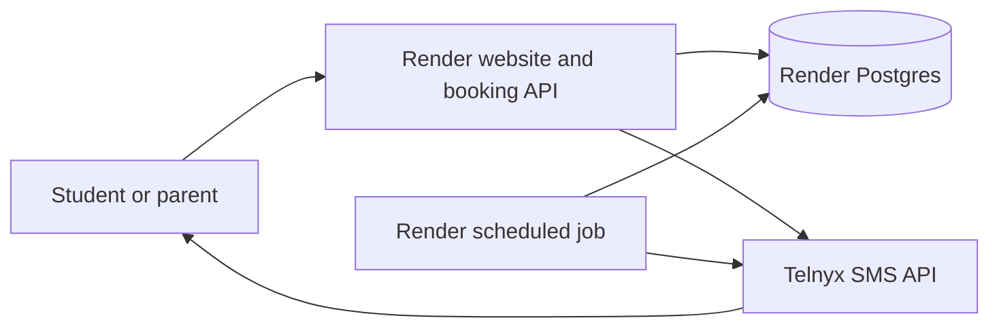

# Scott Howard Tennis — Website, Booking, and Reminder Options

_Planning estimate, September 27, 2026. Prices are in USD and should be checked before purchase._

## Purpose

Scott found the written website report difficult to visualize. A visual design or working preview can help him review the proposed five-page site. The proposed production site would also let students sign up for lessons, retain booking records, and send SMS reminders.

The [website report](report.md) proposes Home, Why Scott, Coaching Programs, Rates & Policies, and Contact pages. The design estimates below assume those five pages, reuse of existing photographs and draft content, and one revision round.

## Visual review options

| Deliverable | Estimated hours | At $160/hour | What Scott can review |
|---|---:|---:|---|
| Home and one representative inner-page mockup | 10–16 | $1,600–$2,560 | Visual direction on desktop and mobile |
| Five-page visual mockups | 25–40 | $4,000–$6,400 | Layout and content hierarchy across the proposed site |
| Five-page responsive static preview | 40–65 | $6,400–$10,400 | Real pages, images, navigation, and visible contact actions |

The preview estimate describes a reviewable demonstration. A production booking system adds database, server-side, messaging, and operational work. Its one-time development cost requires a separate scope and estimate. Mockup and preview costs should not simply be added together if design work is reused.

## Proposed production setup

The website records students, lesson slots, bookings, cancellations, SMS consent, and reminder status in Postgres. Booking should prevent two students from claiming the same available slot. Scott needs a way to review and change bookings. The website and job can reach Postgres through [Render's private network](https://render.com/docs/private-network).

The scheduled job checks for bookings whose reminders need scheduling, reconciles failed or missed schedules, and records results. It is a [Render cron job](https://render.com/docs/cronjobs), which runs and exits, rather than a continuously running [background worker](https://render.com/docs/background-workers). Telnyx's [scheduled messaging](https://telnyx.com/release-notes/scheduled-messaging) handles the actual send time. Store the Telnyx message ID with the booking so a pending reminder can be cancelled and replaced after a schedule change. Telnyx's [scheduling guide](https://main-preview--telnyxdotcom-docs.netlify.app/docs/messaging/messages/schedule-message) currently states a five-day advance scheduling window and describes cancellation of pending messages; verify these limits in the live account before implementation.

### Reminder timing

- For lessons **at or after 9 AM Pacific**, schedule the reminder **four hours before** the lesson.
- For lessons **before 9 AM Pacific**, schedule it for **8 PM Pacific the preceding evening**. An 8 AM lesson therefore receives its reminder at 8 PM the night before.
- Store lesson times with their intended `America/Los_Angeles` time zone, and convert the chosen reminder instant to UTC when submitting it to Telnyx. This preserves the intended time across daylight-saving changes.
- If a lesson is booked after its reminder time has passed, send a booking confirmation and do not schedule an obsolete reminder. The precise short-notice policy remains to be agreed with Scott.

The earlier idea of running a job hourly from 5 AM through 10 PM can still work for reconciliation because Telnyx holds the scheduled messages. If the app sends reminders directly from the job instead, that schedule cannot meet every four-hour target. Render cron schedules use [UTC](https://render.com/docs/cronjobs), so the job should check Pacific local time in code or its UTC schedule must be adjusted for daylight saving.

## Persistence options on Render

| Option | Use for this project | Limitation |
|---|---|---|
| [Paid Render Postgres](https://render.com/docs/postgresql) | **Recommended source of truth** for students, lesson slots, bookings, and reminder records | Requires paid database compute and storage. Paid databases include [point-in-time recovery](https://render.com/docs/postgresql-backups); the Hobby workspace recovery window is three days. |
| [Render Key Value](https://render.com/docs/key-value) | Optional future queue or cache | Free instances do not persist data. Paid instances offer persistence modes, but a relational database is a better fit for booking records. |
| [Persistent disk](https://render.com/docs/disks) | Files attached to a single running service | The cron job cannot access the disk, and another service cannot share it. Unsuitable as the booking source of truth. |
| [Free Render Postgres](https://render.com/docs/free) | Temporary development trial | Expires after 30 days and has no managed backups or recovery. Unsuitable for live student bookings. |

## Recurring cost estimate

Assumptions: a small paid web service serves the site and booking API; Postgres starts with 1 GB of storage; one cron job runs up to 10 minutes at each hourly start from 5 AM through 10 PM; one U.S. local Telnyx number sends one single-part SMS per lesson; Scott qualifies for a sole-proprietor 10DLC campaign. The **$100 per 30 days** supplied for development is treated as an **ongoing allowance**, not the initial build price.

| Fixed item | Approximate cost per month or 30 days |
|---|---:|
| [Render paid web service](https://render.com/pricing) | $7.00 |
| [Render Postgres entry compute](https://render.com/pricing) | $6.00 |
| [Postgres storage, 1 GB](https://render.com/pricing) | $0.30 |
| [Render cron job](https://render.com/docs/cronjobs) | $1.00 |
| [Telnyx local number](https://telnyx.com/products/phone-numbers), starting price | $1.00 |
| [Telnyx sole-proprietor 10DLC campaign](https://support.telnyx.com/en/articles/13545282-guide-to-sole-proprietor-10dlc-brand-and-campaign-registration) | $2.00 |
| Ongoing development allowance | $100.00 |
| **Fixed planning subtotal** | **$117.30** |

Render bills by calendar month, so the table is an approximation for a 30-day planning period. At 18 ten-minute runs daily for 30 days, the job would run for 5,400 minutes. Render's entry cron rate of $0.00016/minute is $0.864 for that runtime, so its [$1 monthly minimum](https://render.com/docs/cronjobs) applies. Actual runtime may be shorter.

[Telnyx's U.S. local-number rate](https://telnyx.com/pricing/messaging) is $0.004 per outbound SMS part plus carrier fees. Major U.S. carrier fees are generally about $0.0035–$0.0045 per part. The examples budget **$0.008 per one-part reminder**. The actual rate depends on carrier and message length.

| One-part reminders per 30 days | Estimated SMS usage | Estimated total including fixed subtotal |
|---:|---:|---:|
| 100 | $0.80 | **$118.10** |
| 500 | $4.00 | **$121.30** |
| 1,000 | $8.00 | **$125.30** |

Sole-proprietor registration is approximately **$19 one time** ($4 brand registration plus $15 campaign vetting), according to [Telnyx's guide](https://support.telnyx.com/en/articles/13545282-guide-to-sole-proprietor-10dlc-brand-and-campaign-registration). The registration path and recurring fee may differ if Scott has a business tax ID. Campaign approval must be completed before automated SMS goes live.

For comparison, [Twilio's current U.S. outbound SMS base price](https://www.twilio.com/en-us/sms/pricing/us) is $0.0083 per part plus carrier fees, with [local numbers starting at $1.15/month](https://www.twilio.com/en-us/phone-numbers). At this project's likely volume, Telnyx's lower unit rate saves only a few dollars per month. Both providers offer scheduled SMS; provider choice should also account for integration and support experience.

## Items excluded or still to decide

- **Initial build cost:** the visual estimates above do not cover implementing student booking, Scott's booking administration, Postgres, SMS integration, or production testing. These need a separate project estimate.
- **Student signup model:** decide whether a student books an available slot immediately or requests a lesson for Scott to confirm. This materially changes the booking workflow.
- **SMS recipients and consent:** decide whether reminders go to adult students, parents, or both. Record consent in the booking flow and handle opt-outs. Two recipients or multi-part texts increase SMS charges.
- **Booking changes:** define cancellation and rescheduling rules, and ensure a cancelled booking cancels its pending reminder where possible. Store provider message IDs and delivery outcomes.
- **Other variable charges:** taxes, inbound replies, additional SMS parts, domain renewal, and Render usage above included limits are outside the table.
